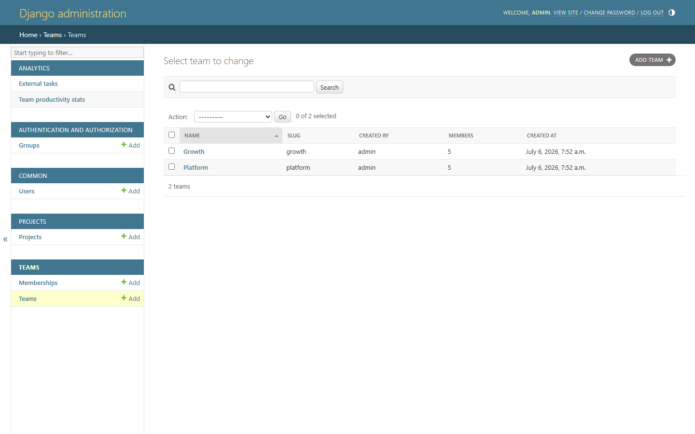
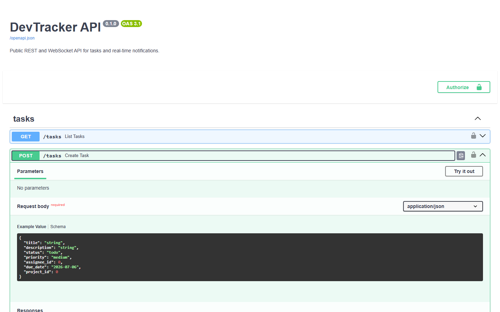

# DevTracker

A project and team-productivity tracking platform built as a **polyglot microservice
architecture** in Python. Three services, three frameworks, one shared PostgreSQL
instance with strict per-service table ownership, asynchronous background processing
with Celery, and an Nginx reverse proxy in front of everything.

This is a portfolio project: the goal is to demonstrate framework breadth (Django,
FastAPI, Flask), sound service boundaries, cross-service authentication, real-time
messaging, containerization, testing discipline and CI/CD, all in one coherent
codebase.

## Architecture

```
                              +---------------------+
                              |        NGINX        |
                              |    reverse proxy    |
                              |    rate limiting    |
                              +---------------------+
                                |        |        |
              /admin /auth     |        | /api   |     /reports
              /static          |        |        |
            +------------------+  +-----+-----+  +------------------+
            |                  |  |           |  |                  |
   +--------------------+  +--------------------+  +--------------------+
   |    core-django     |  |    api-fastapi     |  |   reports-flask    |
   |--------------------|  |--------------------|  |--------------------|
   | users, teams,      |  | task CRUD (async)  |  | PDF productivity   |
   | projects, JWT      |  | WebSocket events   |  | reports, CSV       |
   | issuing, admin UI  |  | JWT validation     |  | export, JWT valid. |
   +--------------------+  +--------------------+  +--------------------+
            |                  |         |                   |
            |                  |         | pub/sub           |
            |                  |         |                   |
   +-----------------------------------+   +-------------+   |
   |            PostgreSQL             |   |    Redis    |   |
   |-----------------------------------|   |-------------|   |
   | common_user      (django owns)    |   | task events |   |
   | teams_team       (django owns)    |   | celery      |   |
   | projects_project (django owns)    |   | broker      |   |
   | tasks            (fastapi owns)   |   +-------------+   |
   | ...stats         (django owns)    |          |          |
   +-----------------------------------+          |          |
            |         |                           |          |
            +---------+---------------------------+----------+
                      |
        +-------------------------------+
        | celery-worker + celery-beat   |
        |-------------------------------|
        | hourly productivity stats     |
        | daily email summary (mock)    |
        +-------------------------------+
```

All external traffic enters through Nginx. Every service validates the same JWT
tokens (issued by core-django), so a single login works across the whole platform.

## Why three frameworks

This is the core of the portfolio story: each framework was picked for what it is
genuinely best at, not spread around arbitrarily.

| Service | Framework | Reasoning |
|---|---|---|
| core-django | Django + DRF | Owns identity and organizational data. Django's batteries (auth, permissions, migrations, admin) make it the fastest way to a robust user/team/project backbone. The built-in admin panel gives operations a full CRUD UI for free, and `djangorestframework-simplejwt` provides a battle-tested JWT issuer. |
| api-fastapi | FastAPI | The public, high-traffic surface. Async endpoints handle many concurrent clients cheaply, Pydantic v2 gives strict request/response validation, WebSockets are first-class for real-time task notifications, and OpenAPI/Swagger documentation is generated automatically. |
| reports-flask | Flask | A deliberately minimal internal service with two endpoints. Flask's tiny footprint fits: no ORM models, no async, just SQL reads and PDF/CSV generation with `reportlab`. It also demonstrates that a microservice can (and often should) be small. |

## The key architectural decision: shared database, separate ownership

Services share one PostgreSQL instance, but **each table has exactly one owner that
migrates and writes it**:

- core-django owns and migrates `common_user`, `teams_team`, `teams_membership`,
  `projects_project`, `analytics_teamproductivitystats` (Django migrations).
- api-fastapi owns and migrates `tasks` (Alembic), with real foreign keys into
  Django's tables. It reads `projects_project` and `common_user` directly but never
  writes them.
- reports-flask owns nothing; it is read-only over both services' tables.

The alternative (each service with its own database, communicating over internal
REST) was considered and rejected for this project's scale: it would add network
hops, retry/error handling and eventual-consistency complexity without buying
anything here, while cross-service foreign keys and JOIN-based reporting would be
lost. The trade-off and failure modes are discussed in
[docs/architecture.md](docs/architecture.md).

## Repository layout

```
devtracker/
  services/
    core-django/        auth, teams, projects, admin, celery tasks
    api-fastapi/        public REST API and WebSocket notifications
    reports-flask/      PDF and CSV report generation
  shared/               devtracker-shared package (enums shared by services)
  infra/
    docker/             one multi-stage Dockerfile per service
    nginx/              reverse proxy configuration
    docker-compose.yml  the whole stack
  tests/integration/    black-box tests across services through nginx
  .github/workflows/    CI: lint, typecheck, test, build, E2E, GHCR push
  docs/                 architecture deep dive
```

## Quickstart

Prerequisites: Docker with the Compose plugin.

```sh
git clone <this-repo>
cd devtracker

# CREATE YOUR LOCAL ENV FILE AND ADJUST SECRETS IF DESIRED
cp .env.example .env

# BUILD AND START EVERYTHING (POSTGRES, REDIS, THREE SERVICES, CELERY, NGINX)
docker compose --env-file .env -f infra/docker-compose.yml up -d --build --wait

# LOAD DEMO USERS, TEAMS AND PROJECTS
docker compose --env-file .env -f infra/docker-compose.yml exec core-django \
    python manage.py seed_demo_data
```

Then open:

| URL | What you get |
|---|---|
| http://localhost/admin/ | Django admin (user: `admin`, password: `devtracker123`) |
| http://localhost/api/docs | Swagger UI for the task API |
| http://localhost/api/health | FastAPI health check |
| http://localhost/reports/health | Flask health check |

## API walkthrough

```sh
# 1. LOG IN AS A SEEDED DEMO USER AND CAPTURE THE ACCESS TOKEN
curl -s -X POST http://localhost/auth/token/ \
  -H "Content-Type: application/json" \
  -d '{"username": "alice", "password": "devtracker123"}'
# RESPONSE: {"refresh": "...", "access": "..."}

TOKEN="<paste the access token here>"

# 2. WHO AM I, AND WHICH TEAMS AM I IN
curl -s http://localhost/auth/me/ -H "Authorization: Bearer $TOKEN"
curl -s http://localhost/auth/me/teams/ -H "Authorization: Bearer $TOKEN"

# 3. CREATE A TASK (THE SAME TOKEN WORKS AGAINST FASTAPI)
curl -s -X POST http://localhost/api/tasks \
  -H "Authorization: Bearer $TOKEN" \
  -H "Content-Type: application/json" \
  -d '{"title": "Ship the MVP", "project_id": 1, "priority": "high"}'

# 4. LIST AND UPDATE TASKS
curl -s "http://localhost/api/tasks?project_id=1" -H "Authorization: Bearer $TOKEN"
curl -s -X PATCH http://localhost/api/tasks/1 \
  -H "Authorization: Bearer $TOKEN" \
  -H "Content-Type: application/json" \
  -d '{"status": "done"}'

# 5. DOWNLOAD REPORTS (THE SAME TOKEN WORKS AGAINST FLASK TOO)
curl -s -o productivity.pdf \
  "http://localhost/reports/productivity.pdf?team_id=1" \
  -H "Authorization: Bearer $TOKEN"
curl -s "http://localhost/reports/tasks.csv?team_id=1" \
  -H "Authorization: Bearer $TOKEN"
```

Real-time notifications: connect a WebSocket client to
`ws://localhost/api/ws/notifications?token=<access token>` and you will receive a
JSON event every time any client creates, updates or deletes a task.

## Screenshots

Django admin with the seeded teams (custom columns, member counts, and the
read-only analytics models in the sidebar):



Auto-generated Swagger UI with the POST /tasks operation expanded:



## Testing and code quality

Each service has its own isolated test suite (no Docker required, in-memory SQLite
and fakeredis stand in for infrastructure):

```sh
cd services/core-django   && pip install -r requirements-dev.txt -e ../../shared && pytest --cov
cd services/api-fastapi   && pip install -r requirements-dev.txt -e ../../shared && pytest --cov
cd services/reports-flask && pip install -r requirements-dev.txt -e ../../shared && pytest --cov
```

Current coverage: core-django 98 percent, api-fastapi 97 percent, reports-flask
96 percent. CI enforces a floor of 80 percent.

Cross-service integration tests run against the live compose stack and are skipped
automatically when it is not up:

```sh
pip install -r tests/integration/requirements.txt
pytest tests/integration
```

Tooling: `ruff` (lint + import sorting), `black` (formatting), `mypy` with
`django-stubs` (types), `pre-commit` hooks for all of the above. CI runs every
check on every push and pull request, builds all Docker images, boots the full
stack for the integration suite, and pushes images to GitHub Container Registry on
merges to main.

## Background processing

Celery runs in two dedicated containers sharing the core-django codebase:

- `celery-worker` executes tasks.
- `celery-beat` schedules them: hourly per-team productivity snapshots (stored in
  `analytics_teamproductivitystats`, visible read-only in the admin) and a daily
  productivity summary email to team owners (mock SMTP: the console email backend
  logs the message instead of sending it).

## Further reading

- [docs/architecture.md](docs/architecture.md) - data flow between services, table
  ownership, JWT contract, WebSocket event pipeline, migration strategy and the
  trade-offs behind the shared-database decision.
